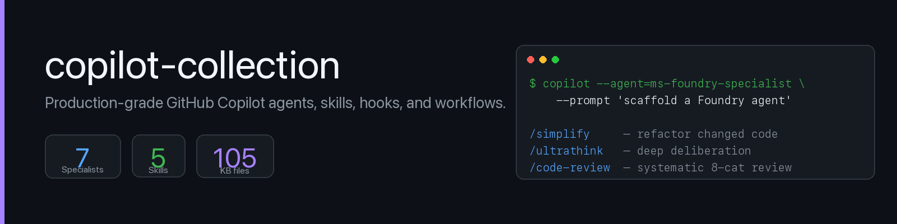

<p align="center">
  
</p>

<p align="center">
  <a href="LICENSE"></a>
  <a href="#"></a>
  <a href="#"></a>
  <a href="#"></a>
  <a href="#"></a>
</p>

# copilot-collection

A curated, production-grade collection of **GitHub Copilot custom agents, skills, instructions, hooks, workflows, and recipes** — built around real engineering work in **Microsoft Foundry, Microsoft Fabric, Power BI, Azure DevOps, and AI/LLM systems**.

Compatible with **GitHub Copilot CLI** and **VS Code Copilot**. Validated against the official [custom-agents](https://docs.github.com/en/copilot/reference/custom-agents-configuration) and [skills](https://docs.github.com/en/copilot/how-tos/copilot-cli/customize-copilot/add-skills) specifications.

> **Why this exists.** Most "AI for X" content is shallow, vendor-pushed, or quickly stale. This collection bakes in:
> - 90-day re-validation cycle on every knowledge-base file
> - Domain-specific anti-patterns flagged on sight
> - Strict spec compliance (passes CI validation)
> - Real workflows (`/simplify`, `/ultrathink`, `/code-review`) used in production

---

## Table of Contents

- [What's in here](#whats-in-here)
- [Available specialists (agents)](#available-specialists-agents)
- [Available skills](#available-skills)
- [Other artifacts](#other-artifacts)
- [Installing GitHub Copilot CLI](#installing-github-copilot-cli)
- [Installing the LSP / VS Code extension](#installing-the-lsp--vs-code-extension)
- [Installing this collection](#installing-this-collection)
- [Configuring agents and skills](#configuring-agents-and-skills)
- [Configuring hooks](#configuring-hooks)
- [Configuring instructions](#configuring-instructions)
- [Configuring workflows](#configuring-workflows)
- [Invoking](#invoking)
- [Knowledge base re-validation](#knowledge-base-re-validation)
- [Bidirectional sync with private projects](#bidirectional-sync-with-private-projects)
- [Creating a new agent](#creating-a-new-agent)
- [CI validation](#ci-validation)
- [Standards & references](#standards--references)
- [License](#license)

---

## What's in here

```
copilot-collection/
├── agents/                 7 domain specialists, each in its own folder
│   └── <name>/
│       ├── <name>.agent.md   The agent definition (frontmatter + body)
│       └── references/        The agent's knowledge base
├── skills/                 5 procedural playbooks (/simplify, /ultrathink, etc.)
├── instructions/           Coding standards auto-applied by file pattern
├── hooks/                  Automated actions on session events
├── workflows/              Agentic GitHub Actions
├── plugins/                Plugin manifests for marketplace install
├── cookbook/               End-to-end recipes
├── docs/                   Reference docs per artifact type
├── _templates/             Templates for generating new agents
└── scripts/                Validation, sync, and scaffolding utilities
```

---

## Available specialists (agents)

Each agent is a deep specialist in its domain, with its own knowledge base of concepts, patterns, and anti-patterns. Invoked via `--agent=<name>` or auto-routed based on description.

| Agent | Domain | Use it for |
|-------|--------|-----------|
| [`ms-foundry-specialist`](agents/ms-foundry-specialist/) | Microsoft Foundry | Foundry Agent Service, Foundry IQ, azure-ai-projects SDKs, Microsoft Agent Framework |
| [`python-specialist`](agents/python-specialist/) | Python for AI/LLM systems | Async clients, structured output, retries, tool-use loops, evals |
| [`observability-specialist`](agents/observability-specialist/) | Observability / Telemetry | KQL, Application Insights, OpenTelemetry, sampling, dashboards |
| [`powerbi-tmdl-specialist`](agents/powerbi-tmdl-specialist/) | Power BI / TMDL / DAX | PBIP projects, DAX evaluation context, time intelligence, RLS, XMLA deployment |
| [`eval-framework-specialist`](agents/eval-framework-specialist/) | LLM evaluation framework | Deterministic + AI-assisted + agentic metrics, golden datasets, regression tracking |
| [`microsoft-fabric-specialist`](agents/microsoft-fabric-specialist/) | Microsoft Fabric | Lakehouse, Warehouse, OneLake, Delta tables, semantic-model REST API |
| [`azure-devops-specialist`](agents/azure-devops-specialist/) | Azure DevOps | Pipeline YAML, REST API, branch policies, workload identity federation, PR automation |

Each agent KB averages **15 files** (concepts + patterns + anti-patterns + manifest + index + quick-reference). All KBs follow the [90-day re-validation protocol](docs/README.knowledge.md).

---

## Available skills

Skills are procedural playbooks invoked via slash commands or auto-routed. They load instructions and bundled scripts/references into the current context.

| Skill | What it does |
|-------|--------------|
| [`/simplify`](skills/simplify/) | Refactors recently-changed code: removes duplication, dead code, premature abstraction. Includes a `find_duplicates.py` helper. |
| [`/ultrathink`](skills/ultrathink/) | Forces structured deliberation for hard architectural decisions: restate → 3+ options → tradeoff matrices → recommend → "what would change my mind". Includes 10 reusable decision frameworks. |
| [`/code-review`](skills/code-review/) | Systematic 8-category PR review: security → correctness → error handling → types → performance → testing → observability → maintainability. |
| [`/kb-revalidate`](skills/kb-revalidate/) | Re-validates KB files older than 90 days against authoritative sources. Includes `find_stale_kb_files.sh`. |
| [`/agentic-eval`](skills/agentic-eval/) | Designs eval suites for an agent: deterministic checks, AI-assisted scorers, agentic metrics, golden datasets. Includes `seed_failure_modes.py`. |

---

## Other artifacts

| Type | Items | Purpose |
|------|-------|---------|
| **Instructions** | [python](instructions/python.instructions.md) | Auto-applied to `**/*.py` — uv + ruff + mypy strict + Pydantic v2 + async-first |
| **Hooks** | [kb-staleness-warning](hooks/kb-staleness-warning/) | sessionStart hook warning if any KB file >90 days old (throttled 24h) |
| **Workflows** | [eval-regression](workflows/eval-regression.md) | PR-time eval comparison vs baseline on `main`, posts comment + status |
| **Cookbook** | [recipe-creating-a-foundry-agent](cookbook/recipe-creating-a-foundry-agent.md) | End-to-end walkthrough: scaffold a deployable Foundry agent with Foundry IQ, OTel, evals |
| **Plugins** | One manifest per agent | Marketplace-installable bundles |

---

## Installing GitHub Copilot CLI

**1. Install Node.js 22+** (required by Copilot CLI):

```bash
# macOS (Homebrew)
brew install node

# Linux (via nvm)
curl -o- https://raw.githubusercontent.com/nvm-sh/nvm/v0.40.0/install.sh | bash
nvm install 22

# Windows
winget install OpenJS.NodeJS
```

Verify:
```bash
node --version    # should print v22.x or higher
```

**2. Install Copilot CLI:**

```bash
npm install -g @github/copilot
```

**3. Authenticate** (you need an active Copilot subscription):

```bash
copilot auth login
```

Follow the device-code flow in your browser. Then verify:

```bash
copilot --version
copilot --help
```

**4. Optional — set default model and permissions:**

```bash
# Default model (claude-sonnet-4-5, gpt-4.1, etc.)
copilot config set model claude-sonnet-4-5

# Allow tool use without prompting per command
copilot config set tool-approval auto-for-allowed
```

For full configuration: see the [official docs](https://docs.github.com/en/copilot/how-tos/copilot-cli).

---

## Installing the LSP / VS Code extension

For users who prefer VS Code with Copilot Chat instead of (or alongside) the CLI:

**1. Install the GitHub Copilot extension** (already includes Chat):
- VS Code → Extensions → search for "GitHub Copilot"
- Or via CLI: `code --install-extension GitHub.copilot`

**2. Install the GitHub Copilot Chat extension:**
- `code --install-extension GitHub.copilot-chat`

**3. Sign in:**
- Open Command Palette (`Cmd+Shift+P`) → `GitHub Copilot: Sign In`

**4. Confirm Agent Skills are enabled:**
- Settings → search `copilot.chat.agent` → ensure "Agent mode" is enabled

VS Code reads agents from `.github/agents/`, skills from `.github/skills/`, instructions from `.github/instructions/` — same paths as the CLI.

---

## Installing this collection

Three options, depending on your use case:

### Option 1 — Marketplace plugin (per-agent)

```bash
# Register this collection as a marketplace (one-time)
copilot plugin marketplace add rafaelolsr/copilot-collection

# Install a single agent
copilot plugin install ms-foundry-specialist@copilot-collection
copilot plugin install python-specialist@copilot-collection
copilot plugin install eval-framework-specialist@copilot-collection
```

### Option 2 — Install a skill via gh

```bash
gh skill install rafaelolsr/copilot-collection simplify
gh skill install rafaelolsr/copilot-collection ultrathink
gh skill install rafaelolsr/copilot-collection code-review
```

### Option 3 — Git clone & copy (full control)

```bash
git clone https://github.com/rafaelolsr/copilot-collection.git
cd copilot-collection

# Copy agents (folder includes .agent.md AND references/ KB)
cp -r agents/ms-foundry-specialist your-repo/.github/agents/

# Copy skills (folder includes SKILL.md + scripts/references)
cp -r skills/simplify your-repo/.github/skills/

# Copy instructions
cp instructions/python.instructions.md your-repo/.github/instructions/

# Copy hooks
cp -r hooks/kb-staleness-warning your-repo/.github/hooks/

# Copy workflows (under agentic/ to avoid conflict with GitHub Actions YAML)
mkdir -p your-repo/.github/workflows/agentic
cp workflows/eval-regression.md your-repo/.github/workflows/agentic/
```

---

## Configuring agents and skills

After installation (any method), Copilot auto-discovers agents and skills from these locations:

| Artifact | Project-scope path | User-scope path |
|----------|-------------------|-----------------|
| Agents | `.github/agents/<name>.agent.md` | `~/.copilot/agents/<name>.agent.md` |
| Skills | `.github/skills/<name>/SKILL.md` | `~/.copilot/skills/<name>/SKILL.md` |

**Verify Copilot sees them:**

```bash
copilot --help                    # in your project
# OR inside an interactive session:
/agents                            # lists available agents
/skills list                       # lists available skills
/skills info simplify              # details on a specific skill
```

If a freshly-added artifact isn't visible: run `/skills reload` or restart Copilot CLI.

**Tools allow-list per agent:**

Each agent's frontmatter declares which tools it can use (least-privilege):

```yaml
---
name: ms-foundry-specialist
tools: ["read", "edit", "search", "execute", "web"]
---
```

Available tool names: `read`, `edit`, `search`, `execute`, `web`, `todo`, `agent`, plus `<server>/*` for MCP tools (e.g., `github/*`, `playwright/*`). See the [official tool spec](https://docs.github.com/en/copilot/reference/custom-agents-configuration#tools).

---

## Configuring hooks

Hooks fire on Copilot session events (e.g., `sessionStart`, `sessionEnd`).

**1. Place the hook directory:**

```bash
mkdir -p .github/hooks
cp -r hooks/kb-staleness-warning .github/hooks/
chmod +x .github/hooks/kb-staleness-warning/check-kb-staleness.sh
```

**2. Verify `hooks.json`:**

```json
{
  "name": "kb-staleness-warning",
  "events": ["sessionStart"],
  "command": "./check-kb-staleness.sh",
  "blocking": false,
  "throttle_seconds": 86400
}
```

**3. Override defaults via env vars** (optional):

```bash
export KB_STALENESS_THRESHOLD_DAYS=60       # default 90
export KB_STALENESS_QUIET_HOURS=12          # default 24
```

**4. Test it:**

```bash
.github/hooks/kb-staleness-warning/check-kb-staleness.sh
```

If KB is fresh: silent. If any file >90 days old: warning to stderr.

---

## Configuring instructions

Instructions are coding standards that auto-apply when Copilot works on files matching a pattern.

**1. Place the instruction file:**

```bash
mkdir -p .github/instructions
cp instructions/python.instructions.md .github/instructions/
```

**2. Frontmatter declares the file pattern:**

```yaml
---
name: python
applyTo: "**/*.py,pyproject.toml,uv.lock"
---
```

When Copilot edits any file matching this pattern, the instruction loads into context — no explicit invocation needed. To verify:

```bash
# Edit a Python file with Copilot — it should follow uv + ruff + mypy strict
copilot --prompt "create a new module src/my_app/client.py with an async Anthropic wrapper"
```

The generated code should use `uv` not `pip`, type hints, async/await, no hardcoded keys.

---

## Configuring workflows

Agentic workflows are GitHub Actions written in markdown — they run on PR / schedule / issue events.

**1. Place workflow file under `agentic/`** to avoid conflict with regular GitHub Actions YAML:

```bash
mkdir -p .github/workflows/agentic
cp workflows/eval-regression.md .github/workflows/agentic/
```

**2. Frontmatter declares trigger and outputs:**

```yaml
---
name: "Eval Regression Check"
on:
  pull_request:
    paths: ['src/agents/**', 'src/workflows/modules/*/prompts/**']
permissions:
  contents: read
  pull-requests: write
safe-outputs:
  add-pr-comment:
    label: "eval-regression"
  add-pr-status:
    context: "eval-regression"
---
```

**3. Add required secrets** to your repo (Settings → Secrets and variables → Actions):

```
ANTHROPIC_API_KEY            # for the agent under test
ANTHROPIC_JUDGE_API_KEY      # different key for the judge model
AZURE_AI_PROJECT_CONNECTION_STRING   # for Foundry-based agents
```

**4. Verify the workflow** by opening a PR that touches `src/agents/`. It should:
- Run smoke evals against the new code
- Compare metrics to the baseline run on `main`
- Post a comparison comment + set `eval-regression` status

---

## Invoking

```bash
# Auto-routing — Copilot picks the right agent / skill from the description
copilot --prompt "scaffold a Foundry agent in Python with a calculator tool"
copilot --prompt "review my changes for over-engineering"

# Explicit agent
copilot --agent=ms-foundry-specialist --prompt "write a Foundry IQ knowledge base setup"
copilot --agent=python-specialist --prompt "add retries to this LLM client"

# Explicit skill (slash command)
/simplify
/ultrathink should we use Lakehouse or Warehouse for this 5GB model?
/code-review
/kb-revalidate domain=ms-foundry
/agentic-eval

# Slash management
/agents                       # list available agents
/skills list                  # list available skills
/skills info simplify         # show skill details
/skills reload                # pick up newly-added skills
```

Pair them: a code review followed by simplification followed by tests:

```bash
/code-review
/simplify
copilot --agent=python-specialist --prompt "write tests for the changes"
```

---

## Knowledge base re-validation

Every KB file (concept, pattern, anti-pattern, index) has a `last_validated:` field. After 90 days, content is suspect — SDKs version-bump, products rename, best practices evolve. The collection enforces this with three layers:

**1. Hook** (passive nag): `hooks/kb-staleness-warning/` warns at session start if any file is stale. Throttled 24h.

**2. Skill** (active workflow): `/kb-revalidate` walks the procedure:
- Identifies stale files
- Fetches authoritative sources
- Surfaces discrepancies
- Updates files in place

**3. Documentation**: [`docs/README.knowledge.md`](docs/README.knowledge.md) explains the protocol.

Run manually:

```bash
# Find stale files
.github/skills/kb-revalidate/scripts/find_stale_kb_files.sh --threshold-days 90

# Re-validate a specific domain
copilot --prompt "/kb-revalidate domain=ms-foundry"
```

---

## Bidirectional sync with private projects

Most agents in this collection originated in private projects (e.g., a Foundry production workspace) where they proved their value before being curated here.

The `scripts/sync.sh` utility moves agents between this public collection and a private project:

```bash
# Pull from a private project into this collection
scripts/sync.sh pull /path/to/private-project ms-foundry-specialist

# Push from this collection into a private project
scripts/sync.sh push /path/to/private-project ms-foundry-specialist

# See what differs (no changes)
scripts/sync.sh diff /path/to/private-project ms-foundry-specialist
```

Sync handles path translation between the two layouts:
- **Collection**: `agents/<name>/<name>.agent.md` + `agents/<name>/references/`
- **Project**: `.github/agents/<name>.agent.md` + `.github/agents/kb/<domain>/`

Sync is **manual by design** — automated bidirectional sync invites merge conflicts and accidental overwrites. Always review the diff before committing.

---

## Creating a new agent

Use the generator at [`_templates/AGENT_CREATION_PROMPT_COPILOT.md`](_templates/AGENT_CREATION_PROMPT_COPILOT.md):

1. Copy the template into a Copilot CLI session
2. Fill the DECLARATION block (name, role, domain, sources, concepts, patterns)
3. Run — the prompt generates the agent, KB, and plugin manifest
4. Run `scripts/validate.sh` to verify everything passes CI checks
5. Open a PR

For new skills, see [`docs/README.skills.md`](docs/README.skills.md).
For new instructions, see [`docs/README.instructions.md`](docs/README.instructions.md).
For new hooks, see [`docs/README.hooks.md`](docs/README.hooks.md).
For new workflows, see [`docs/README.workflows.md`](docs/README.workflows.md).
Full contribution flow: [CONTRIBUTING.md](CONTRIBUTING.md).

---

## CI validation

Every PR runs `scripts/validate.sh` automatically via GitHub Actions:

- **Agent files**: frontmatter is parseable YAML using only spec-allowed fields (`name`, `description`, `target`, `tools`, `model`, `disable-model-invocation`, `user-invocable`, `mcp-servers`, `metadata`); `description` under 1,400 chars; body under 30,000 chars
- **No auto-link corruption**: code blocks free of `](http://...)` patterns
- **Tool names**: match official Copilot CLI spec (`read`, `edit`, `search`, etc.)
- **KB integrity**: `references/` exists with required files; cross-references resolve; no unfilled `{{placeholders}}`
- **Skills**: `SKILL.md` has frontmatter with `name` + `description`
- **Plugin manifests**: agent reference path resolves

Run locally:

```bash
bash scripts/validate.sh
```

Expected: `0 errors, N warnings` (warnings are usually legitimate cross-domain references).

---

## Standards & references

- [GitHub Copilot CLI custom agents](https://docs.github.com/en/copilot/reference/custom-agents-configuration)
- [Adding agent skills for GitHub Copilot CLI](https://docs.github.com/en/copilot/how-tos/copilot-cli/customize-copilot/add-skills)
- [Creating custom agents for Copilot CLI](https://docs.github.com/en/copilot/how-tos/copilot-cli/customize-copilot/create-custom-agents-for-cli)
- [VS Code Agent Skills](https://code.visualstudio.com/docs/copilot/customization/agent-skills)
- [Copilot CLI documentation index](https://docs.github.com/en/copilot/how-tos/copilot-cli)

---

## License

[MIT](LICENSE) © Rafael (RafaelOLSR)

---

<p align="center">
  <em>Built for engineers who want their AI agents to know what they're talking about.</em>
</p>
